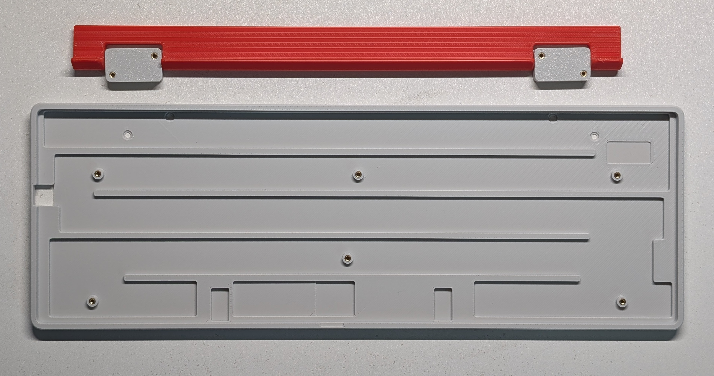
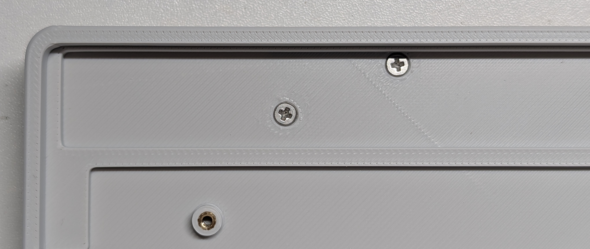
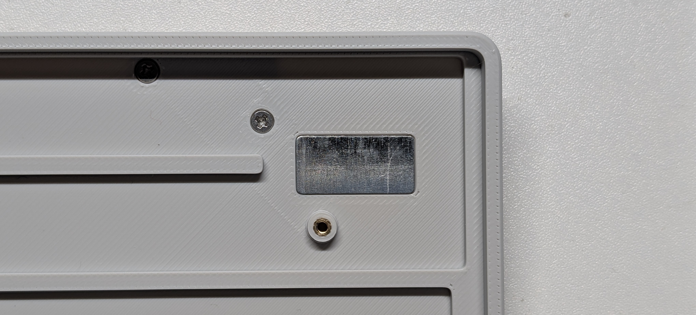

### [English Ver.](README.md) | 中文
---

# PH60 Slim-Choc  
[](https://creativecommons.org/licenses/by-nc-sa/4.0/)

**PH60 Slim-Choc 是一款采用ANSI 60%配列的矮轴机械键盘，专为便携与客制化设计**  


---

## 目录
- [PH60 Slim-Choc](#ph60-slim-choc)
  - [目录](#目录)
  - [产品特性](#产品特性)
  - [所需组件](#所需组件)
  - [打印指南](#打印指南)
    - [外壳](#外壳)
    - [键帽](#键帽)
  - [组装教程](#组装教程)
  - [固件配置（开发中）](#固件配置开发中)
    - [QMK/VIA 设置](#qmkvia-设置)
  - [参与贡献](#参与贡献)
  - [常见问题](#常见问题)
  - [特别鸣谢](#特别鸣谢)
  - [相关链接](#相关链接)
  - [开源协议](#开源协议)
  - [更新日志](#更新日志)

---

## 产品特性
+ 📏 **极致纤薄**：前高仅7mm（视觉高度4.5mm）
+ 🧲 **可调节脚撑**：支持5°和10°两档调节的磁吸折叠脚撑
+ 💻 **笔电友好**：侧出Type-C接口完美适配笔记本电脑
+ 🔅 **热插拔设计**：兼容凯华Choc V1/V2矮轴
+ 🖨️ **易生产性**：专为3D打印/CNC工艺优化
+ ⚡ **全键编程**：支持QMK/VIA开源固件

---

## 所需组件
| 部件名称                   | 数量 | 备注                                  |
|---------------------------|------|---------------------------------------|
| PH60Slim-Choc PCB         | 1    | 淘宝店购买（可选）                    |
| M2×2×3 热熔铜柱           | 10   | 用于外壳固定                          |
| M2×3 平头螺丝             | 4    | 脚撑安装                              |
| M2×5 平头螺丝             | 6    | 外壳组装                              |
| 20×10×0.5mm 导磁钢板      | 1    | 磁吸定位                              |
| 10×4×2mm N52磁铁          | 1    | 脚撑固定                              |
| 矮轴卫星轴                | 5    | 4×2u + 1×6.25u                      |
| 凯华Choc矮轴              | 61   | 兼容V1/V2版本                         |
| 外壳组件                  | 1套  | 含底壳/脚撑/定位板                    |
| 键帽                      | 61   | 建议DSA高度                           |

---

## 打印指南
本设计已针对拓竹打印机优化参数，其他机型用户可参考以下设置：
### 外壳
- **打印配置文件**: [MakerWorld](https://makerworld.com/en/models/1361888)
- **耗材类型**: PLA 
- **层高**: 0.16mm（可接受0.2mm）
- **壁厚**: 4层，Arachne壁厚生成器
- **填充密度**: 100% 
- **支撑**: 树状支撑（自动生成）

### 键帽
- **打印配置文件**: 参考[MakerWorld](https://makerworld.com/en/models/1394378)
- **耗材类型**: PETG

---

## 组装教程
1. **安装热熔铜柱**  
   - 使用200°C烙铁将铜柱嵌入外壳（底壳8个，脚撑4个）  
   

2. **嵌入磁铁**  
   - 将N52磁铁压入脚撑预留槽  
   

3. **组装脚撑**  
   - 用M2×3螺丝固定，确保角度切换顺滑  
   

4. **安装导磁板**  
   - 点胶后将钢板嵌入底壳凹槽  
   

5. **粘贴防滑垫**  
   - 在底壳边角粘贴硅胶防滑垫  
   

6. **PCB总成安装**  
   - 对齐定位板与PCB，预装卫星轴和轴体后，用M2×5螺丝均匀锁紧  
   

7. **最终装配**  
   - 最后轴体，测试导通性后安装键帽  
   

---

## 固件配置（开发中）
### QMK/VIA 设置
1. **源码编译**:  
   ```bash
   qmk compile -kb phdesign/ph60slim_choc -km via
   ```
2. **刷写固件**:  
   用金属工具短接空格区附近的Boot孔，插入USB线后，将固件拖入出现的U盘图标

3. **键位更改**:  
   通过[VIA](https://usevia.app/)直接配置

---

## 参与贡献
欢迎通过以下方式参与项目：  
1. Fork本仓库
2. 创建功能分支
3. 提交附带详细说明的PR

**注意事项**:  
- 固件修改需遵循QMK编码规范  
- 硬件修改需提供STEP文件  
- 文档站将会在后期上线

---

## 常见问题
**Q: 支持哪些轴体？**  
A: 仅限凯华Choc轴，不兼容佳达隆或樱桃轴。

**Q: 特殊卫星轴哪里购买？**  
A: 淘宝有售，也可修改定位板使用凯华原厂卫星轴（需自行验证）。

**Q: Type-C接口无法识别？**  
A: 请检查接口与外壳开孔是否对齐。

**Q: 推荐键帽高度？**  
A: 需使用专用矮轴键帽，也可尝试我们的3D打印键帽方案。

---

## 特别鸣谢
- QMK开源社区提供的固件支持
- Bambu Lab提供的3D打印技术支持

---

## 相关链接
- [GitHub仓库](https://github.com/ph-design/PH60Slim-Choc)
- [Discord社区](https://discord.gg/8UfQXcefPH)
- [组装视频（B站）](https://www.bilibili.com/video/BV1Te5VzBEiK/)
- [购买链接（淘宝）](https://shop268559013.taobao.com/)
- [3D打印配置文件](https://makerworld.com/en/@M_Altmann)
- [官方网站](https://phdesign.cc)

---

## 开源协议
本项目采用[CC BY-NC-SA 4.0](https://creativecommons.org/licenses/by-nc-sa/4.0/)协议授权。

---

## 更新日志
- **2025年5月10日**: 首次发布

---

*项目维护：ph.design 发布时间：2025.05 
