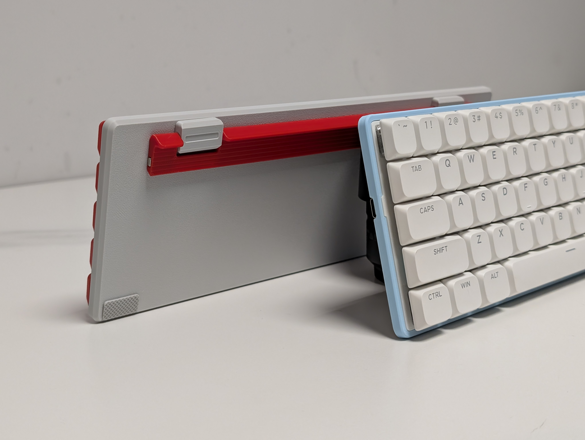

 # PH60Slim-Choc
**Slim-Choc is a 60% ANSI layout low-profile mechanical keyboard.**

# Features
+ 📏 7mm physical front height (4.5mm in visual)
+ 🧲 Magnetic 2-step footstand provides 5° and 10° typing angle
+ 💻 Side-out USB-C connect designed for laptops
+ 🔅 Use Kailh low-profile hotswap switches
+ 🖨️ Designed for 3D printing and CNC
+ ⚡ Powered by QMK firmware and VIA support

# Required Components
|Part name                           |Amount  |Remark                                         |
|------------------------------------|--------|-----------------------------------------------|
|PH60Slim-Choc PCB                   |1       |Purchase in our Taobao Store (optional)        |
|M2\*2*3 Heat insert                 |10      |                                               |
|M2*3 Flat screw                     |4       |                                               |
|M2*5 Flat screw                     |6       |                                               |
|20\*10*0.5mm Iron piece             |1       |Or anything thin and can be acttract by magnet |
|10\*4*2mm N52 Magnet                |1       |                                               |
|Low-profile stabilizer              |5       |4\*1.5u and 1\*6.25u                           |
|Kailh low-profile switch            |61      |                                               |
|Bottom case                         |1       |                                               |
|Footstand                           |1       |                                               |
|Mounting plate                      |1       |                                               |
|Keycaps                             |61      |Printed low-profile keycaps provided (optional)|

# Printing Guide
The Slim-Choc components are designed to print without any tunnning, but using the following profile setting will slightly increse the overall quality. If you are using a Bambu Lab printer, download the profile from [MakerWorld](https://makerworld.com/zh/models/1361888) is recommended.

+ Layer height: 0.16mm
+ Circle compensation: ON
+ Wall generator: Arachne
+ Wall loops: 4
+ Infill: 100%
+ Support: Tree (auto)

# Assembly Guide
1. Remove the support and inplant all the heat inserts (8 on bottom case, 4 on stand). 

2. Insert the magnet into the right side of the feet. 

3. Tighten the feet with 4 flat head screws. 

4. Apply glue and insert a iron piece into the bottom case. 

5. Stick a set of silicon pads. 

6. Put Slim-Choc PCB and mounitng plate in the bottom case and tighten 8 flat head screws. 

7. Install switches and keycaps. 

# More descriptions WIP
