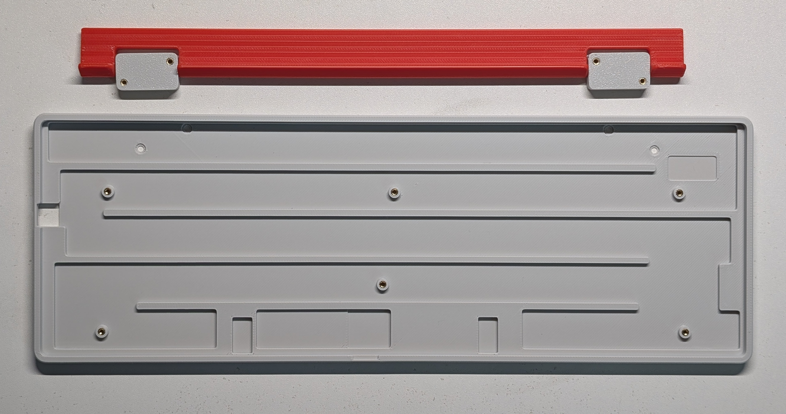
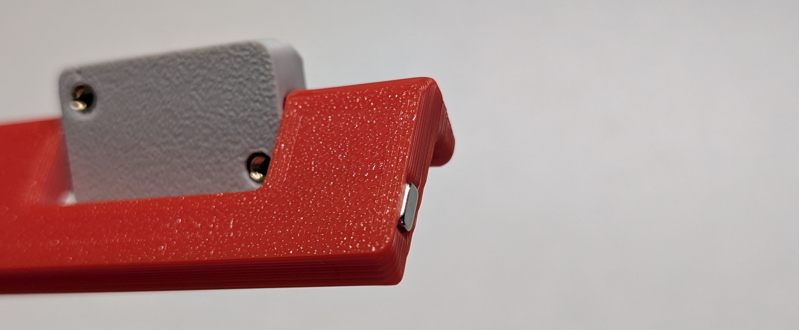
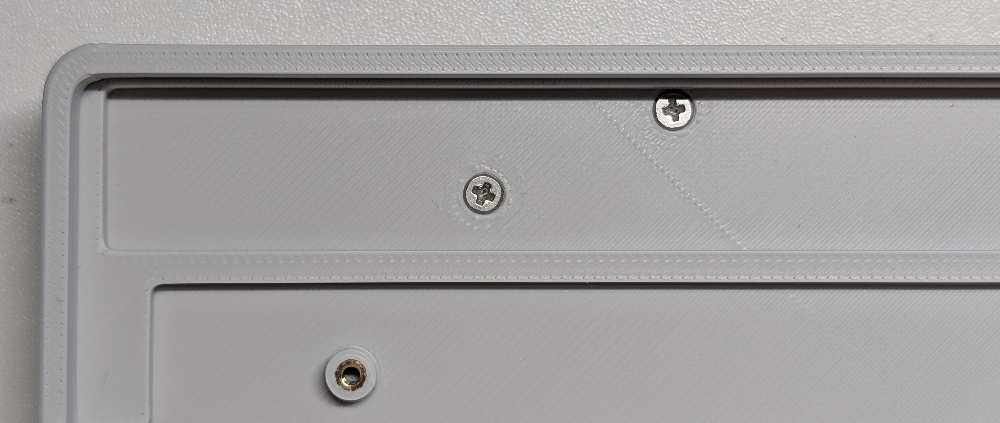
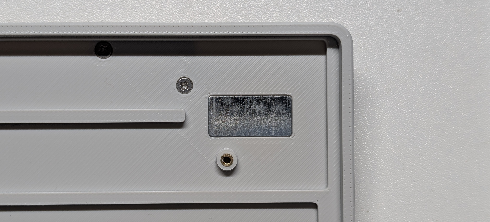
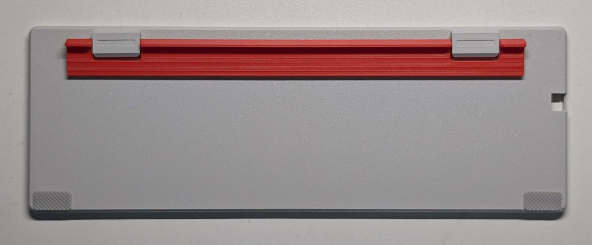
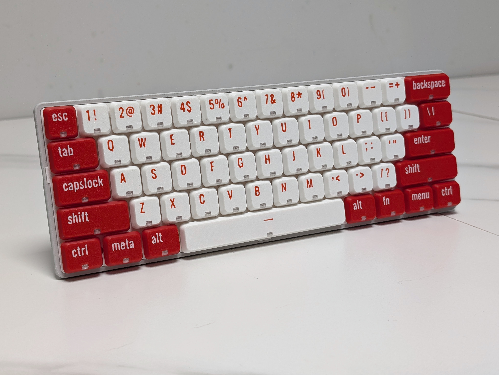

# PH60 Slim-Choc  
[](https://creativecommons.org/licenses/by-nc-sa/4.0/)

**PH60 Slim-Choc is a 60% ANSI layout low-profile mechanical keyboard designed for portability and customization.**  


---

## Table of Contents
- [PH60 Slim-Choc](#ph60-slim-choc)
  - [Table of Contents](#table-of-contents)
  - [Features](#features)
  - [Required Components](#required-components)
  - [Printing Guide](#printing-guide)
    - [Case](#case)
    - [Keycaps](#keycaps)
  - [Assembly Guide](#assembly-guide)
  - [Firmware \& Configuration (WIP)](#firmware--configuration-wip)
    - [QMK/VIA Setup](#qmkvia-setup)
  - [Contributing](#contributing)
  - [FAQ](#faq)
  - [Special thanks](#special-thanks)
  - [Links](#links)
  - [License](#license)
  - [Changelog](#changelog)

---

## Features
+ 📏 **Ultra-Slim Design**: 7mm physical front height (4.5mm visual)
+ 🧲 **Adjustable Typing Angle**: Magnetic 2-step foldable footstand (5° and 10°)
+ 💻 **Laptop-Friendly**: Side-out USB-C for seamless laptop integration
+ 🔅 **Hotswap Ready**: Kailh Choc V1/V2 low-profile switches
+ 🖨️ **Easy Manufacturing**: Optimized for 3D printing/CNC
+ ⚡ **QMK & VIA Support**: Fully programmable with open-source firmware

---

## Required Components
| Part Name                          | Amount | Remark                                        |
|------------------------------------|--------|-----------------------------------------------|
| PH60Slim-Choc PCB                  | 1      | Purchase in our Taobao Store (optional)       |
| M2×2×3 Heat-Set Inserts            | 10     | For securing case components                  |
| M2×3 Flat Head Screws              | 4      | Footstand mounting                            |
| M2×5 Flat Head Screws              | 6      | Case assembly                                 |
| 20×10×0.5mm Ferrous Plate          | 1      | Magnet alignment                              |
| 10×4×2mm N52 Magnet                | 1      | Footstand retention                           |
| Low-Profile Stabilizers            | 5      | 4×2u + 1×6.25u                              |
| Kailh Choc Switches                | 61     | Compatible with Choc V1/V2                    |
| Case Components                    | 1 set  | Includes bottom case, footstand, plate        |
| Keycaps                            | 61     | DSA height recommended                        |

---

## Printing Guide
Slim-Choc components are optimized for Bambu Lab printers. However, they can also be printed with other printers by adjusting some of the parameters as follow:
### Case
- **Printing Profile**: [MakerWorld](https://makerworld.com/en/models/1361888)
- **Filament**: PLA 
- **Layer Height**: 0.16mm (0.2mm acceptable)
- **Walls**: 4 loops, Arachne wall generator
- **Infill**: 100% 
- **Supports**: Tree (auto)

### Keycaps
- **Printing Profile**: Follow [MakerWorld](https://makerworld.com/en/models/1394378)
- **Filament**: PETG

---

## Assembly Guide
1. **Heat-Set Inserts**  
   - Use soldering iron at 200°C to install inserts (8 in case, 4 in footstand).  
   

2. **Magnet Installation**  
   - Press-fit N52 magnet into footstand recess.  
   

3. **Footstand Assembly**  
   - Secure with M2×3 screws. Ensure smooth angular adjustment.  
   

4. **Ferrous Plate Attachment**  
   - Apply glue and insert an iron piece into the case. 
   

5. **Anti-Slip Pads**  
   - Apply silicone pads to case corners.  
   

6. **PCB & Plate Integration**  
   - Align plate with PCB, insert stabilizers and switches partially, then mount to case with M2×5 screws (torque evenly).  
   

7. **Final Assembly**  
   - Fully seat switches, test connectivity, then install keycaps.
   

---

## Firmware & Configuration (WIP)
### QMK/VIA Setup
1. **Compile from Source**:  
   ```bash
   qmk compile -kb phdesign/ph60slim_choc -km via
   ```
2. **Flashing**:  
  Shorten the boot perforations around the space with a metal object, plug in the USB cable, and drag the firmware into the USB drive that appears.

1. **Keymap Editor**:  
   Configure directly via [VIA Web](https://usevia.app/)

---

## Contributing
We welcome contributions! Please:  
1. Fork the repository
2. Create a feature branch
3. Submit PR with detailed description  

**Guidelines**:  
- Follow QMK coding standards for firmware  
- Include STEP files for hardware modifications  
- A dedicated documentation website will be available soon.

---

## FAQ
**Q: What switches can I use?**  
A: **ONLY** Kailh Choc switch, not Gateron or Cherry.

**Q: Where can I get the special stabilizer?**  
A: It can be found on Taobao, or modify the mounting plate to use Kailh official stabilizer (Not verified).

**Q: USB-C port not detected?**  
A: Ensure proper alignment of side-out connector with case cutout.

**Q: Recommended keycap?**  
A: Special low-profile keycaps are required. You can try our 3D-printed keycaps alternatively.

---

## Special thanks
- QMK Community for firmware support
- Bambu Lab for 3D printing support

---

## Links
- [GitHub Repository](https://github.com/ph-design/PH60Slim-Choc) 
- [Discord Community](https://discord.gg/8UfQXcefPH)
- [Build Video (Bilibili)](https://www.bilibili.com/video/BV1Te5VzBEiK/)
- [Purchase link (Taobao)](https://shop268559013.taobao.com/)
- [3D Printing Profiles](https://makerworld.com/en/@M_Altmann)
- [Official Website](https://phdesign.cc)

---

## License
This project is licensed under the [CC BY-NC-SA 4.0](https://creativecommons.org/licenses/by-nc-sa/4.0/) license.

---

## Changelog
- **2025-05-10**: Initial release.

---

*Project maintained by ph.design Released: 2025.05 
